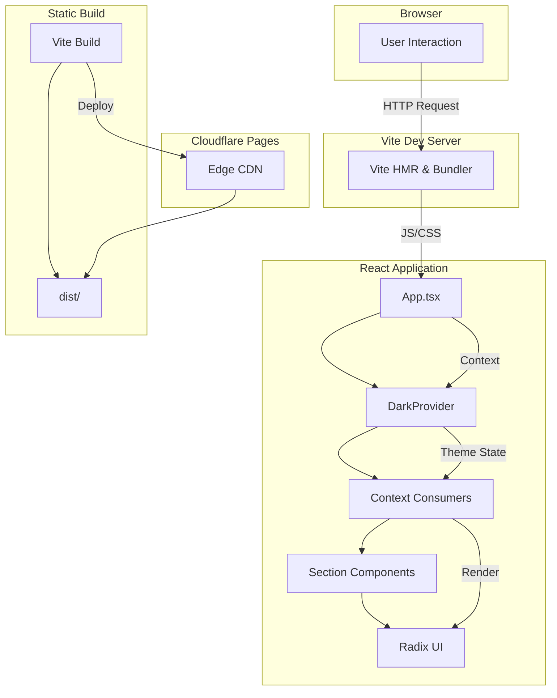

# Digital Resume

[]
[]
[]

A premium, modern, and dynamically animated personal biography web application built with React and TypeScript. It delivers a visually striking, glass‑morphic interface with global dark‑mode support, targeting developers and professionals who require a polished digital presence.

## Live Demo

🚀 **Experience the live preview**: <https://portfolio-site.yo-kinto-x.workers.dev/>

## Key Features

- **Glass‑morphic UI** with gradient backgrounds and subtle micro‑animations.
- **Global dark‑mode** managed via a React Context, ensuring theme consistency across all components.
- **Responsive layout** optimized for mobile, tablet, and desktop viewports.
- **Component‑driven architecture** leveraging Radix UI primitives and custom animations.
- **Type‑safe development** using TypeScript with strict linting and testing configuration.
- **Static site generation** optimized for deployment on Cloudflare Pages.
- **Extensible design system** based on Tailwind CSS and CSS variables for theming.

## Tech Stack and System Requirements

**Frontend**
- React 18.3.1
- TypeScript 5.8.3
- Vite 5.4.19 (build tool & dev server)
- Tailwind CSS 4 (utility‑first styling)
- Radix UI components (accessibility‑focused UI primitives)
- Zod (schema validation)

**Build & Tooling**
- Node.js ≥ 20
- pnpm ≥ 9
- ESLint (static analysis)
- Wrangler CLI (Cloudflare Pages deployment)

**Infrastructure**
- Cloudflare Pages (static hosting, edge cache)

## Installation and Environment Setup

```bash
# Clone the repository
git clone https://github.com/your-org/digital-resume.git
cd digital-resume

# Install dependencies
pnpm install
```

## Application Execution

**Local Development**
```bash
pnpm dev
```
Starts the Vite development server at `http://localhost:5173` with hot‑module replacement.

**Production Build**
```bash
pnpm build
```
Generates an optimized static bundle in the `dist/` directory.

**Deploy to Cloudflare Pages**
```bash
# Install Wrangler if not present
pnpm add -g wrangler

# Authenticate with Cloudflare
wrangler login

# Deploy the static site
wrangler pages deploy ./dist --project-name digital-resume
```

## System Architecture and Data Flow



## License

The project is licensed under the MIT License. See the `LICENSE` file for full terms.
