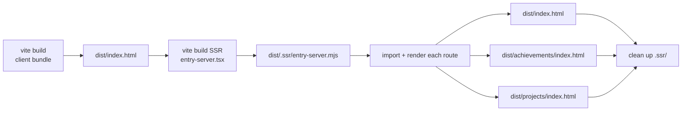

# Static Prerendering (SSG) Implementation

## Problem

The site is a client-side rendered (CSR) React SPA. The Vite build produces a bare HTML shell:

```html
<div id="root"></div>
<script type="module" crossorigin src="/assets/index-xyz.js"></script>
```

AI evaluators, search engine crawlers, and any HTTP client that doesn't execute JavaScript see **zero content** — a blank page. The user's Lighthouse/performance audit flagged this as "SSR/prerendering problem."

## Solution: Build-time Static Prerendering

Instead of full server-side rendering (SSR) at request time, we render the React app to static HTML at **build time**. The output is a fully-formed HTML file for each route, served directly by Cloudflare Workers' static asset handler.

```
pnpm build
  ├── tsc -b                (type-check)
  ├── vite build            (client bundle → dist/)
  └── node scripts/prerender.mjs
        ├── vite build (SSR)    (compile SSR entry for Node.js)
        ├── renderToString()    (run React in Node.js for each route)
        └── inject into HTML    (write dist/<route>/index.html)
```

### Why `renderToString` (not Puppeteer / `vite-plugin-ssg`)

| Approach | Verdict |
|---|---|
| `vite-plugin-ssg` | Incompatible — requires `vite ^5`, we're on Vite 8 |
| `vite-plugin-prerender` / Puppeteer | Works but needs Chrome installed; heavy CI dependency |
| `react-dom/server.renderToString()` | **Chosen** — zero runtime deps, fast (~60ms SSR build), full control |

## Architecture

### 1. Router splitting (`src/App.tsx`)

The app's router (`BrowserRouter`) calls `createBrowserHistory` which references `document` — crashes in Node.js. We extracted the router-agnostic shell:

```tsx
// App.tsx — exports both
export const AppRoutes = () => (            // ← used by SSR
  <Routes>
    <Route element={<Layout />}>...</Route>
  </Routes>
);

const App = () => (                         // ← used by client
  <DarkProvider>
    <BrowserRouter><AppRoutes /></BrowserRouter>
  </DarkProvider>
);
```

### 2. SSR entry (`src/entry-server.tsx`)

A separate entry point for Node.js build:

```tsx
import { renderToString } from "react-dom/server";
import { StaticRouter } from "react-router-dom";
import { DarkProvider } from "./context/dark-context";
import { AppRoutes } from "./App";

export function render(url: string) {
  return renderToString(
    <StaticRouter location={url}>
      <DarkProvider>
        <AppRoutes />
      </DarkProvider>
    </StaticRouter>
  );
}
```

- `StaticRouter` replaces `BrowserRouter` — no `document` access
- `DarkProvider` wraps (same as client) — its `getInitialTheme()` guards `typeof window !== "undefined"` → returns `false` during SSR

### 3. Client hydration (`src/main.tsx`)

Dual-mode entry — `hydrateRoot` if prerendered HTML exists, `createRoot` otherwise (e.g., dev server):

```tsx
const root = document.getElementById("root")!;
if (root.hasChildNodes()) {
  hydrateRoot(root, <App />);    // production — attach event handlers to existing DOM
} else {
  createRoot(root).render(<App />);  // dev — render from scratch
}
```

### 4. Prerender script (`scripts/prerender.mjs`)



Key steps:

1. **Build client** — normal `vite build`, produces `dist/index.html` (shell) + assets
2. **Build SSR** — `vite build` with `build.ssr: "src/entry-server.tsx"`, output to `dist/.ssr/`
3. **Render** — dynamically imports the SSR bundle, calls `render(url)` for each route, injects into template
4. **Clean up** — removes `dist/.ssr/` (not needed at runtime)

### 5. SSR guards for browser-only APIs

Components that access `document` / `window` during **render** (not just effects) need guards:

| Component | Issue | Fix |
|---|---|---|
| `MiniWebsiteModal` | `createPortal(children, document.body)` | `typeof document !== "undefined" ? createPortal(...) : null` |
| `dark-context.tsx` | `localStorage`, `document.documentElement` | Already had `typeof window !== "undefined"` guard ✅ |
| `use-mobile.tsx` | `window.matchMedia` | Already had `typeof window === "undefined"` guard ✅ |
| `Reveal.tsx` | `window.matchMedia` | Already guarded inside `useEffect` ✅ |
| All `useEffect` usage | DOM calls in effects | Effects don't run during SSR ✅ |

### 6. Build pipeline (`package.json`)

```json
"build": "tsc -b && vite build && node scripts/prerender.mjs",
```

- `tsc -b` — project reference type-check
- `vite build` — client production bundle
- `node scripts/prerender.mjs` — SSR build + HTML injection

No changes to `wrangler.jsonc` — Cloudflare Workers still serves `dist/` as static assets. The SPA fallback (`not_found_handling: "single-page-application"`) remains for any unhandled routes.

## Output

```
dist/
├── index.html                 ← 76KB — full homepage content
├── achievements/
│   └── index.html             ← 84KB — full achievements content
├── projects/
│   └── index.html             ← 87KB — full projects content
├── assets/
│   ├── index-xyz.js           ← client JS bundle
│   ├── index-xyz.css          ← client CSS
│   ├── profile-xyz.jpg
│   └── (other static assets)
└── favicon-square.png
```

Each HTML file contains the fully-rendered React tree — crawlers and AI evaluators see content immediately, no JS execution needed.

## Caveats & Notes

- **Dark mode flash**: SSR renders light mode (no `document/localStorage`). On hydration, dark mode toggles immediately — a brief flash of light HTML before JS runs. Acceptable for this use case.
- **Reveal animations**: Pre-rendered HTML has `opacity: 0; filter: blur(8px)`. Content is visually hidden until JS hydrates and IntersectionObserver fires. Crawlers still read the text in the HTML.
- **Route list is hardcoded**: `["/", "/achievements", "/projects"]`. Adding a new route requires updating this array and the `Route` in `App.tsx`.
- **SSR bundle is temporary**: Built to `dist/.ssr/` during `prerender.mjs`, then cleaned up. Never deployed.
